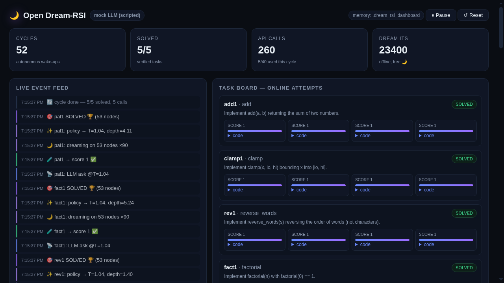
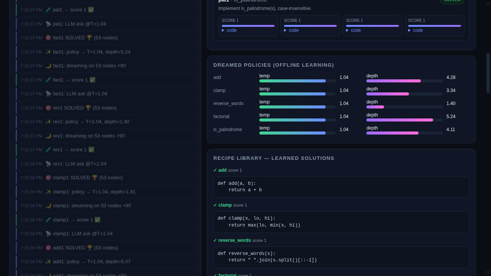
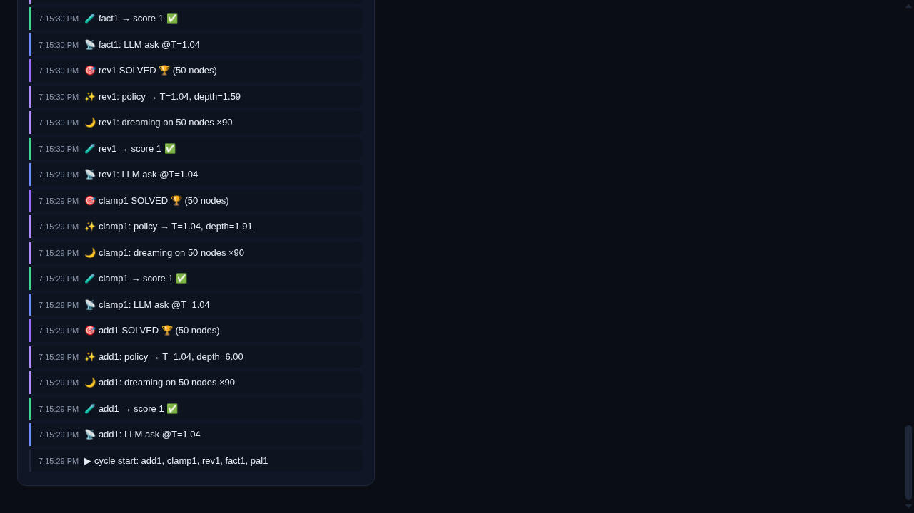

# Open Dream-RSI 🌙🤖

[](https://opensource.org/licenses/MIT)
[](https://www.python.org/)

An open, lightweight and general-purpose implementation of the **Dream-RSI**
(*Recursive Self-Improvement through Evolving Worlds*) architecture described in
research work by Google & Google DeepMind.

**Open Dream-RSI** lets LLM agents optimize their exploration and problem-solving
strategies for hard tasks (e.g. GPU kernel authoring, algorithmic optimization)
**without modifying model weights** and with a minimal number of expensive API calls.

---

## 🎯 How it works

Traditional *self-improvement* loops burn thousands of LLM queries on trial and
error in the real world. **Open Dream-RSI** works in two phases:

1. **Online Execution:** The agent attempts the task in the real world, building a *Discovery Tree*.
2. **Offline Dreaming:** Instead of running expensive real-world rollouts, the agent "dreams" over the execution history. It evaluates thousands of strategy variants in an offline simulator, consuming zero additional external tool calls.
3. **Deployment:** The best generated strategy is shipped back into online execution.

---

## 🤖 LLM integration (OpenAI-compatible)

The agent talks to any **OpenAI-compatible** endpoint — just point it at a
`POST {base_url}/chat/completions` server:

| Provider | Preset | Base URL | API key env var |
|---|---|---|---|
| OpenAI | `openai` | `https://api.openai.com/v1` | `OPENAI_API_KEY` |
| **Cursor Models API** | `cursor` | `https://api2.cursor.sh` | `CURSOR_API_KEY` |
| Local (vLLM / Ollama / LM Studio) | `local` | `http://127.0.0.1:8000/v1` | `OPENAI_API_KEY` |

```python
from open_dream_rsi import LLMConfig, OpenAICompatibleClient, DreamAgent, DreamEngine, ReplaySimulator, DiscoveryTree

# OpenAI (reads OPENAI_API_KEY from the environment)
client = OpenAICompatibleClient()

# Cursor Models API (reads CURSOR_API_KEY from the environment)
client = OpenAICompatibleClient(LLMConfig.from_preset("cursor"))

# Any other OpenAI-compatible server
client = OpenAICompatibleClient(LLMConfig(base_url="http://127.0.0.1:8000/v1",
                                          api_key="...", model="my-model"))

tree = DiscoveryTree()
dreamer = DreamEngine(simulator=ReplaySimulator(tree))
dreamer.run_offline_optimization(iterations=100)
agent = DreamAgent(dreamer=dreamer, client=client)
```

API keys are **only** read from environment variables — never hard-code them.
The core package has zero external dependencies (stdlib `urllib` transport).

---

## 🚀 Quick start

### Installation

```bash
git clone https://github.com/patrykorwat/open-dream-rsi.git
cd open-dream-rsi
pip install -e .
```

### Basic usage

```python
from open_dream_rsi import DiscoveryTree, DreamEngine, ReplaySimulator

# 1. Initialize the history tree
history = DiscoveryTree()

# 2. Create the replay simulator
simulator = ReplaySimulator(history)

# 3. Run the offline "dreaming" loop
dreamer = DreamEngine(simulator=simulator)
best_policy = dreamer.run_offline_optimization(iterations=100)

print(f"Optimized exploration policy: {best_policy}")
```

Full runnable example (online LLM loop + offline dreaming): `examples/optimize_kernel.py`.

---

## 🖥️ Live dashboard

Watch the loop work in a browser — one command, no dependencies:

```bash
python -m open_dream_rsi dashboard                      # mock LLM, zero setup, port 8765
python -m open_dream_rsi dashboard --provider cursor    # real model via Cursor Models API
python -m open_dream_rsi dashboard --host 0.0.0.0       # LAN access (default)
```

Dark single-page UI: KPIs (cycles / solved / API budget / dream iterations),
live event feed, per-task attempt boards with score bars and code diff-downs,
dreamed-policy gauges per category and the learned recipe library.

**Supervisor overview** — KPIs on top, live event feed on the left:



**Task board** — online attempts per task with verification score bars and
the candidate code that produced them:



**Dreamed policies & recipe library** — policy parameters learned offline per
category (temperature / exploration depth) and the verified solutions the
loop has taught itself, persisted across restarts:



---

## 🤖 Autonomous RSI loop (Hermes-style supervisor)

The runtime runs the improvement cycle **by itself**, with no human in the loop:

```
wake -> pick tasks -> online attempt (LLM + sandbox) -> offline dream
     -> persist policy / recipe / tree -> sleep -> wake ...
```

```bash
export OPENAI_API_KEY=...                     # or CURSOR_API_KEY + --provider cursor
python -m open_dream_rsi loop --tasks tasks.json --interval 300   # daemon
python -m open_dream_rsi loop --tasks tasks.json --once           # single cycle (cron)
python -m open_dream_rsi status                                    # learned policies + recipes
```

`tasks.json`:

```json
[{
  "task_id": "add1",
  "category": "math",
  "prompt": "Implement add(a, b) returning the sum.",
  "tests": [{"call": "add(2, 3)", "expected": 5}],
  "max_attempts": 3
}]
```

What makes it self-improving between runs (persistent `--memory` dir):

* **Dreamed policies** (`policies.json`) — the next cycle of a category starts
  with the policy parameters learned by the last one.
* **Recipe library** (`recipes.json`) — best verified solutions per category,
  replayed as warm starts, so re-solving is nearly free.
* **Archived discovery trees** (`trees/`) — offline dreaming always has history.
* **Event log** (`events.jsonl`) — append-only audit of every decision.

Guards: `--budget` caps API calls per cycle (dreaming stays free), candidate
code runs in an isolated subprocess (`python -I`, scrubbed env, timeout) so a
misbehaving solution cannot reach your API keys. Live walkthrough with a mock
OpenAI server: `examples/live_loop_demo.py`.

---

## 📊 Benchmark

`bench` compares two arms on the same task suite and the same (scripted or real)
model — the only difference is the library machinery:

```bash
python -m open_dream_rsi bench --cycles 10 --markdown                # deterministic mock, no key
python -m open_dream_rsi bench --provider cursor --cycles 10         # your own model
```

| arm | solves | API calls | calls / task·cycle | dream its | wall (s) |
|---|---|---|---|---|---|
| cold_baseline (fresh memory each cycle) | 50 | 100 | 2.0 | 0 | 1.5 |
| dream_rsi_loop (policies + recipes + dreaming) | 50 | 55 | 1.1 | 3000 | 0.8 |

**45% fewer API calls at equal solve quality** on the built-in suite (10 cycles
× 5 tasks, mock client — deterministic and key-free; the model arm is a
constant, so the delta comes purely from warm starts and persistent policies).
This mirrors the Dream-RSI paper's headline result — competitive discovery
quality at substantially reduced online budget — at library scale.

---

## 🔭 Related work & positioning

* **Dream-RSI: Recursive Self-Improvement through Evolving Worlds**
  (Zheng et al., Google / Google DeepMind / UMD, [arXiv:2609.14858](https://arxiv.org/abs/2609.14858)) —
  the paper this library implements. Official repo: [zhengkid/Dream-RSI](https://github.com/zhengkid/Dream-RSI);
  method explainer: [dream-rsi.com](https://dream-rsi.com/).
* Since the paper's release (2026-09-14) several **independent implementations** have appeared;
  this repo is one of them, not the first. Notable peers:
  [TheAstrayDev/dream-rsi-sdk](https://github.com/TheAstrayDev/dream-rsi-sdk) (model-agnostic
  adapter SDK, strict replay, seven built-in exploration policies, evidence-based promotion
  gates — LLM-written policy code on their roadmap),
  [robinber/dream-rsi-spark](https://github.com/robinber/dream-rsi-spark) (independent section-3
  implementation: local Qwen + CUDA kernel exploration on NVIDIA DGX Spark), plus agent/skill
  variants ([lesterppo/hermes-dream-rsi](https://github.com/lesterppo/hermes-dream-rsi),
  [Harkit2004/dream-rsi-skill](https://github.com/Harkit2004/dream-rsi-skill),
  [mailbobg/Pi-RSI](https://github.com/mailbobg/Pi-RSI), …).
  What this repo aims to differentiate on: an **always-on autonomous supervisor** (self-scheduling
  cycles with an API-call budget guard), **persistent cross-run memory** (dreamed policies +
  verified-solution recipes as warm starts), a live web dashboard, a measurable API-saving
  benchmark (`bench`), sandboxed verification, zero runtime dependencies, MIT license.
* **OpenRSI / OpenMLE / Frontis-MA1** ([FrontisAI/OpenRSI](https://github.com/FrontisAI/OpenRSI)) —
  a different layer of the same problem. They post-train model *weights*
  (SFT+RL, a 35B meta-evolution agent on MLE-Bench); Open Dream-RSI optimises
  the *exploration policy around a frozen model* — no training, no GPU, no
  weight access. The two are complementary: their trained improver could be
  the frozen LLM behind our client, our dreaming loop could sit on top of
  their search. MIT-licensed here; note their stack is CC BY-NC.

---

## 🧩 Module architecture

* `open_dream_rsi.core.tree`: Stores the agent's hypothesis, result and action history.
* `open_dream_rsi.core.simulator`: Simulates state transitions without invoking the external environment.
* `open_dream_rsi.core.dreamer`: Offline optimization loop over generated simulations.
* `open_dream_rsi.core.agent`: LLM agent abstraction driven by the rewarded policy.
* `open_dream_rsi.loop`: `AutoRSIRuntime` — autonomous supervisor (schedule, budget, feedback loop).
* `open_dream_rsi.memory`: `DreamMemory` — persistent policies, recipes, trees, event log.
* `open_dream_rsi.tools`: `CodeVerifier` — sandboxed execution of candidate solutions.
* `open_dream_rsi.cli`: `python -m open_dream_rsi loop|status|dashboard|bench` entry point.
* `open_dream_rsi.bench`: two-arm API-efficiency benchmark (dreaming vs cold baseline).
* `open_dream_rsi.llm`: OpenAI-compatible client (OpenAI, Cursor Models API, local servers).
* `open_dream_rsi.utils.evaluator`: Scoring and ranking of policies over the recorded history.

---

## 📜 License

This project is licensed under the **MIT** license — see the [LICENSE](LICENSE) file for details.
