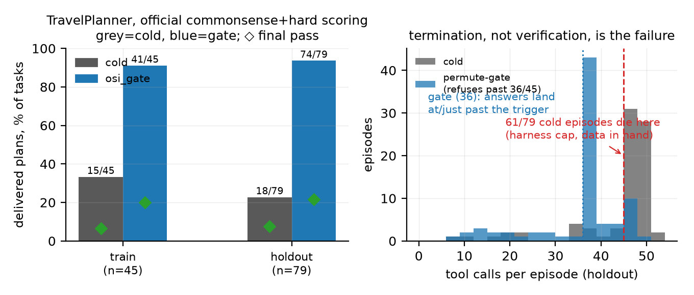
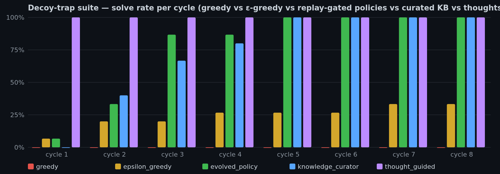

# Open Dream-RSI

> **📄 Preprint:** *Open Dream-RSI: An Open-Source Library for Recursive
> Self-Improvement Around a Frozen LLM, with Replay-Gated Learned Policies and
> a Curated Knowledge Base* — P. Orwat, 2026.
> [**PDF**](paper/main.pdf) · [**LaTeX source**](paper/main.tex)

[](https://opensource.org/licenses/MIT)
[](https://www.python.org/)
[](tests/)

An open, dependency-free implementation of **Dream-RSI** (*Recursive
Self-Improvement through Evolving Worlds*, Zheng et al., Google / Google
DeepMind / UMD, [arXiv:2609.14858](https://arxiv.org/abs/2609.14858)).

The model stays **frozen**. What improves is everything *around* it: the
exploration policy, the verified-solution library, and the curated lessons
learned from failures. The loop optimises its own problem-solving strategy
between runs — persistent memory, replay-gated promotion, budget guards —
and never touches model weights.

**Zero runtime dependencies** (stdlib only), ~6k lines of library code,
~2.5k lines of tests, MIT license, installable with no build step.

---

## How it works

The loop alternates two phases:

1. **Online execution** — the agent attempts each task with the real LLM and
   a sandboxed verifier, appending every attempt to a per-task
   *Discovery Tree* (code, tests feedback, score, one-line plan).
2. **Offline dreaming** — instead of paying for real-world rollouts, the agent
   "dreams" over the recorded history: thousands of strategy variants are
   scored in an in-process replay simulator at zero external-call cost. The
   best parameters, programs and recipes are persisted and steer the next cycle.

Beyond parameter-level dreaming, the loop closes section 3 of the paper
("dreaming with code"): each cycle the LLM may **rewrite the exploration
policy itself** as a small Python program, `choose_action(frontier, step)`.
Candidates are statically validated (AST gate), executed only in a hardened
subprocess sandbox, and scored by **counterfactual replay rollout** on the
recorded tree. A candidate replaces the incumbent only on evidence — and the
incumbent is re-scored on the *current* tree, not trusted at its stored score.
A crashing or cheating policy can never break the loop: expansion falls back
to the greedy baseline.

---

## Quick start

```bash
git clone https://github.com/patrykorwat/open-dream-rsi.git
cd open-dream-rsi
pip install -e .
```

Queue tasks in `tasks.json`:

```json
[{
  "task_id": "add1",
  "category": "math",
  "prompt": "Implement add(a, b) returning the sum.",
  "tests": [{"call": "add(2, 3)", "expected": 5}],
  "max_attempts": 3
}]
```

Run the supervisor — as a daemon, or as a single cycle from cron:

```bash
export OPENAI_API_KEY=***            # any OpenAI-compatible endpoint
python -m open_dream_rsi loop --tasks tasks.json --interval 300
python -m open_dream_rsi loop --tasks tasks.json --once    # cron-friendly
python -m open_dream_rsi status                             # what it has learned
```

No key? Everything deterministic still runs: `bench`, `bench-policy`,
`gate-replay` and the dashboard all use a scripted mock client.
A full in-process walkthrough with a mock OpenAI server:
`examples/live_loop_demo.py`.

### What persists between runs (`--memory` dir)

| Artifact | File | Effect |
|---|---|---|
| Dreamed policy parameters | `policies.json` | next cycle starts from the last one's optimum |
| Promoted policy programs | `policy_codes.json` | LLM-written `choose_action` steers expansion |
| Recipe library | `recipes.json` | verified solutions replayed as warm starts |
| Knowledge base | `lessons.json` | curated, replay-gated lessons (declarative text) |
| Discovery trees | `trees/` | offline dreaming always has history |
| Audit log | `events.jsonl` | append-only record of every decision |

Switches worth knowing: `--no-policy-code`, `--no-knowledge`, `--no-thoughts`,
`--no-judge` ablate the four optional machinery layers; `--budget N` caps API
calls per cycle (dreaming stays free).

---

## Providers

The agent talks to any **OpenAI-compatible** `POST {base_url}/chat/completions`
server. API keys are read **only** from environment variables.

| Provider | Preset | Base URL | Key env var |
|---|---|---|---|
| OpenAI | `openai` | `https://api.openai.com/v1` | `OPENAI_API_KEY` |
| Cursor Models API | `cursor` | `https://api2.cursor.sh` | `CURSOR_API_KEY` |
| Local (vLLM / Ollama / LM Studio) | `local` | `http://127.0.0.1:8000/v1` | `OPENAI_API_KEY` |
| Borrowed from goose config | `goose` | resolved from `~/.config/goose` | — |

Precedence is always: explicit overrides → environment → preset defaults.
Self-hosted reasoning endpoints get `enable_thinking: false` automatically
(a thinking-on Qwen otherwise burns the whole completion budget); an HTTP 400
rejection of that flag triggers a self-heal retry.

Library-level use (no CLI):

```python
from open_dream_rsi import (DiscoveryTree, DreamEngine, ReplaySimulator,
                            DreamAgent, LLMConfig, OpenAICompatibleClient)

client = OpenAICompatibleClient(LLMConfig.from_preset("local"))
tree = DiscoveryTree()
dreamer = DreamEngine(simulator=ReplaySimulator(tree))
dreamer.run_offline_optimization(iterations=100)
agent = DreamAgent(dreamer=dreamer, client=client)
```

---

## Plugging into your coding agent (MCP)

The loop speaks **MCP** — stdio for local agents (Goose, Hermes, Codex CLI,
Claude Code, OpenCode, Zed) and Streamable-HTTP (`mcp --http --port 8800`)
for remote connectors (Claude Cowork / claude.ai). One config block and your
everyday agent can queue tasks for the dreamer, pull verified recipes and
consult curated lessons — **zero extra LLM setup**: the dreamer resolves its
own brain (env → local goose config → localhost vLLM).

```bash
python3 -m open_dream_rsi mcp --tasks ./tasks.json --memory ./.dream_rsi
```

Already inside goose and want the dreamer to use **goose's own model** (no
second API key)? `./scripts/odr_goose_setup.sh` diagnoses the install, starts
the loopback model-borrowing proxy (`python -m open_dream_rsi proxy`, port
8799) and writes the extension block into `~/.config/goose/config.yaml` for
you.

Copy-paste instructions for every supported host:
**[docs/integrations.md](docs/integrations.md)**.

---

## Benchmarks

All headline numbers below are produced by a **scripted solver** and are
claims about the *machinery* (gates, sandboxes, promotion, retrieval), not
about any particular model. Every figure re-measures with one command.

### API efficiency — `bench`

Two arms, one task suite, one (mock) model; the only difference is the
library machinery:

```bash
python -m open_dream_rsi bench --cycles 10 --markdown
```

| arm | solves | API calls | calls / task·cycle | dream its |
|---|---|---|---|---|
| cold_baseline (fresh memory each cycle) | 50 | 150 | 3.0 | 0 |
| dream_rsi_loop (policies + recipes + dreaming) | 50 | 69 | 1.38 | 3000 |

**54% fewer API calls at equal solve quality** — competitive discovery
quality at a reduced online budget, at library scale.

### Real-agent benchmark — goose × TravelPlanner (public, externally scored)

Everything above is scripted-machinery measurement. This one is a real
agent on a public benchmark scored by *its own* evaluators: goose (v1.53)
planning real itineraries against the official TravelPlanner offline
database over a stdlib MCP sandbox, on the validation subset (101
consecutive easy+medium tasks), model `Qwen3.8-Flash-Next` served by vLLM —
a state-of-the-art-class local model. Same endpoint and model across every
study in this repo and the paper.

| arm | delivered plans | commonsense pass | hard pass | final pass |
|---|---|---|---|---|
| cold | 34/101 (34%) | 12 | 8 | 7.9% |
| sentinel v1 (recurrence notes) | 28/101 (28%) | 16 | 10 | 9.9% |



The finding worth more than the arm delta (McNemar p=0.43 — honestly, no
paired effect yet): **92% of undelivered episodes die pinned at the
harness call cap with the data already in hand**, while delivered episodes
average 23 of 45 calls. The binding failure mode of an agent under budget
pressure is *termination*, not error recovery — 73% of cut-off episodes
ended on a clean (non-error) call, which no failure-triggered mechanism
can reach. That measurement drove the second sentinel channel (finalize
nudge, below). Raw per-episode data: `fixtures/tp_v1_summary.json`;
paper §6.4.

### Exploration quality — `bench-policy` (decoy traps)

Solve-rate graphs saturate on easy suites and cannot tell good exploration
from luck, so `bench-policy` hides each fix behind a *low-scoring* branch
(passes 1/3 tests) past a *plausible decoy* (passes 2/3 forever). A
score-greedy loop locks onto the decoy and starves; escaping requires
structural exploration. Five arms, one scripted solver, one budget:

```bash
python -m open_dream_rsi bench-policy --cycles 8 --format md
```

| arm | solves | solve rate | API calls | calls / solve | policy calls | curator calls |
|---|---|---|---|---|---|---|
| greedy | 0/120 | 0% | 480 | ∞ | 0 | 0 |
| epsilon_greedy | 29/120 | 24% | 405 | 13.97 | 0 | 0 |
| **evolved_policy** | **92/120** | **77%** | **252** | **2.74** | 27 | 0 |
| **knowledge_curator** | **88/120** | **73%** | 332 | 3.77 | 0 | 34 |
| **thought_guided** | **120/120** | **100%** | **164** | **1.37** | 0 | 0 |

- **evolved_policy** — the loop asks the LLM for a policy program per
  category, validates and replay-scores it, and promotes only on evidence.
  100% solve rate by cycle 5 while spending *fewer total calls* than ε
  wasted on luck.
- **knowledge_curator** — ε-greedy with zero policy calls: every escape
  above the ε baseline came from remembered knowledge (73%, at parity with
  the gated policies at ~80% of ε's calls).
- **thought_guided** (library default) — each attempt records its one-line
  `PLAN:`; expansion leaves a branch as soon as its idea repeats itself.
  With ε forced to 0 and no policy/curator calls it escapes every trap
  **from cycle 1**; the ledger-only ablation (same text in prompts, pick
  disabled) collapses back to the baselines — the win is the expansion
  rule, not prompt length.



### Would a lesson set have been promoted? `gate-replay`

Applies the shipped promotion rule (`lesson_gate_verdict`) to per-task
outcome pairs from any recorded replay harness — no model, no GPU:

```bash
python -m open_dream_rsi gate-replay \
  --baseline cold=/tmp/arms.json?label=cold \
  --compare lessons=/tmp/arms.json?label=warm \
  --key task_id --format md
```

---

## What the loop learned about memory (honest results)

The knowledge curator (section 4) distils verifier failures into short,
validated, deduplicated **lessons** — pure text, never executed. Live-model
replay, however, proved that fresh lessons are *hazardous by default*:

- Structurally perfect lessons (passed every schema/caps gate) dropped
  solve-rate **18/20 → 6/20** on a greedy decoder: "keep checking"-style
  advice turns greedy decoding into an over-exploration loop.
- The same facts rewritten as **declarative background** (no imperative
  verbs, explicit stop clause): 18/20 — indistinguishable from cold
  (McNemar p=1.0). The hazard is imperative mood, not content.
- Seven further published injection strategies (abstract workflows,
  exemplars, evidence certificates, reactive-on-error notes,
  end-of-prompt position) scored **zero** paired gains against a
  contemporaneous cold baseline; moving safe text to the end of the prompt
  was actively harmful (11/20, p=0.008 — recency makes the model *act* on
  facts that were inert mid-prompt).

The shipped design encodes all of that: lessons are `staging` candidates
that must pass a paired-replay gate (net ≥ 1, **zero** solve→fail
regressions, explicit stop clause) before any prompt sees them; proposal
prompts frame the KB as declarative background; and a per-category
**headroom verdict** (skip curation when recent solve-rate ≥ 0.7 *and*
calls/solve ≤ 5) spends zero curator/gate calls where the cold baseline
already wins. Guidance pays a perturbation tax — the loop only pays it
where there is measurable headroom to spend it against.

---

## Error-class sentinel (deployment artifact)

Curation above is *epistemic* — it reads outcomes after episodes end and
wakes on a schedule. Measured on a real install's session store (~60k tool
messages / 30 days; anonymized fixture in `fixtures/sentinel_audit.json`):
a recurring error class re-appears **within one session** at a median gap
of 4.3 minutes, and half of failing calls are same-class repeats. No
schedule wins that race, so the mechanism moves into the tool-execution
layer of the host runtime.

The engine (`open_dream_rsi/sentinel.py`) is host-independent: error-class
fingerprints (URLs/paths/numbers normalized — different arguments, same
failure), a durable ledger, and one **declarative** note per class per
session at a repeat threshold (recurrence facts plus a stop condition,
never a command — the replay arms showed imperative framing measurably
extends loops). Clean calls pay zero prompt tax: the note rides only
failing results. Adapters: Hermes plugin (`plugins/hermes_sentinel/`),
Claude Code hooks (`plugins/claude_code/`), goose Stop-hook
(`plugins/goose/`), and plain stdin-JSON CLI for any command-hook host
(`python -m open_dream_rsi sentinel check`).

**Second reactive channel — the finalize nudge.** The TravelPlanner study
above showed the dominant failure mode under budget pressure is
termination, not error recovery, and that a Stop-hook delivery burns the
turn it tries to save. The nudge therefore counts *all* tool calls (clean
and failing), fires **at most once per session** at ~80% of the episode's
tool-call budget, and rides an ordinary tool result — never a blocking
hook. Same declarative framing as the recurrence note, with the stop
clause aimed at answering, not at more exploring. `max_notes_per_session`
is an opt-in cap (default 0 = unlimited; episode harnesses pass 8) —
the production replay fixture shows one legitimate session emitting 24
notes, so the engine must not cap by default.

---

## Security model

Candidate code — both task solutions and policy programs — runs in a
hardened subprocess (`open_dream_rsi/sandbox.py`): `python -I`, scrubbed
environment (only `PATH` — API keys never cross the wall), a timeout that
kills the **entire process group**, and POSIX address-space / CPU /
thread-count limits. Policy code additionally passes an AST gate *before*
any spawn: required entry point, no imports, no dunder access, no
`__builtins__` reference (name plus constructed-key indexing is itself an
escape route).

**This is defence in depth, not a container.** The subprocess does not
restrict filesystem or network access, and an AST gate cannot be provably
complete against code that is not statically gated. For hostile task
sources set `ODR_SANDBOX_CMD` to a
[bubblewrap](https://github.com/containers/bubblewrap)/nsjail wrapper
(e.g. `bwrap --unshare-all --die-with-parent --ro-bind / /`) or run the
loop inside a container.

---

## Live dashboard

One command, no dependencies, stdlib http server:

```bash
python -m open_dream_rsi dashboard                   # mock LLM, port 8765
python -m open_dream_rsi dashboard --provider cursor # real model
python -m open_dream_rsi dashboard --host 0.0.0.0    # LAN access
```

Dark single-page UI: KPIs (cycles / solved / API budget / dream iterations),
live event feed, per-task attempt boards with score bars and code diff-downs,
dreamed-policy gauges per category and the learned recipe library.

---

## Positioning

- **The paper this implements:** Dream-RSI
  ([arXiv:2609.14858](https://arxiv.org/abs/2609.14858)); official repo
  [zhengkid/Dream-RSI](https://github.com/zhengkid/Dream-RSI), explainer
  [dream-rsi.com](https://dream-rsi.com/).
- **Peer implementations** (this repo is an independent open one, not the
  first): [TheAstrayDev/dream-rsi-sdk](https://github.com/TheAstrayDev/dream-rsi-sdk)
  (adapter SDK, strict replay; LLM-written policies on their roadmap),
  [robinber/dream-rsi-spark](https://github.com/robinber/dream-rsi-spark)
  (local Qwen + CUDA kernel exploration), plus skill variants
  ([hermes-dream-rsi](https://github.com/lesterppo/hermes-dream-rsi),
  [dream-rsi-skill](https://github.com/Harkit2004/dream-rsi-skill),
  [Pi-RSI](https://github.com/mailbobg/Pi-RSI)).
  What differentiates this repo: an **always-on autonomous supervisor**
  with budget guards, **LLM-written exploration policies** gated by
  counterfactual replay (section 3 closed), a dedicated **decoy-trap
  benchmark**, persistent cross-run memory, and a **negative-results
  section on memory** that the loop itself enforces.
- **OpenRSI / Frontis-MA1** ([FrontisAI/OpenRSI](https://github.com/FrontisAI/OpenRSI))
  is a different layer: they post-train *weights*; this library optimises
  the *exploration policy around a frozen model* — no training, no GPU, no
  weight access. Complementary: their trained improver could be the frozen
  LLM behind our client.

---

## Module architecture

| Module | Role |
|---|---|
| `core.tree` | DiscoveryTree — hypotheses, results, actions, thoughts |
| `core.simulator` | replay simulation without touching the environment |
| `core.dreamer` | offline optimisation over recorded history |
| `core.agent` | LLM agent driven by the rewarded policy |
| `core.policygen` | policy generation, AST gate, rollout scoring, promotion |
| `core.curator` | lesson distillation, headroom verdict, gate verdict |
| `core.judge` | completion judge for test-less (`criteria`) tasks |
| `loop` | `AutoRSIRuntime` — the autonomous supervisor |
| `memory` | `DreamMemory` — policies, recipes, lessons, trees, events |
| `sandbox` | `run_isolated` — the single untrusted-code execution boundary |
| `tools` | `CodeVerifier` — sandboxed verification of candidate solutions |
| `llm` | OpenAI-compatible client (stdlib `urllib` transport) |
| `cli` | `loop / status / dashboard / bench / bench-policy / gate-replay / mcp / proxy / sentinel` |
| `mcp`, `mcp_server` | MCP stdio server for loop tools and sentinel checks |
| `proxy` | loopback OpenAI-compatible proxy borrowing goose's upstream |
| `dashboard` | zero-dependency live web UI |
| `gate_replay` | offline validation of the lesson promotion rule |
| `sentinel` | host-agnostic error-class sentinel engine |
| `utils.goose` | goose config resolver (CLI + desktop dialects, keychain) |
| `plugins/*` | Hermes / Claude Code / goose adapters |

## Tests

```bash
python -m unittest discover -s tests          # or: pytest tests/ -q
```

230 tests, stdlib-only: benchmark behavioural contracts (greedy must solve
nothing; the gated arm must dominate ε; the rollout must be prefix-only),
sandbox escape regressions, gate semantics, MCP protocol, goose config
dialects, sentinel channel semantics (nudge fires once per budget,
merges with recurrence notes, clean calls count toward the budget; the
30-day production replay must reproduce its recorded note count exactly).

## License

MIT — see [LICENSE](LICENSE).
